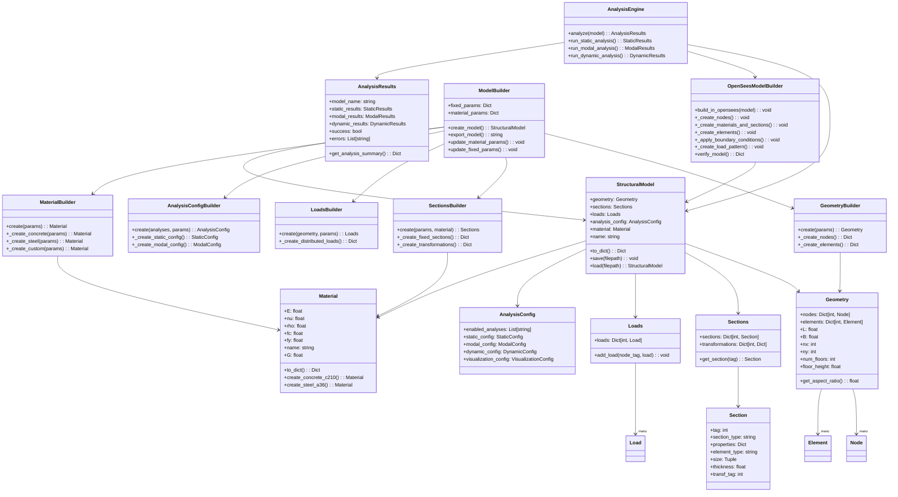

# Plan de Implementación Futura - OpenSees Parametric Analysis

## 📋 Resumen Ejecutivo

Este documento define la roadmap de desarrollo para expandir el sistema OpenSees Parametric Analysis hacia un framework completo de análisis estructural paramétrico con capacidades de predimensionamiento automático.

## 🎯 Objetivos Estratégicos

### Objetivo Principal
Evolucionar de un sistema de análisis paramétrico básico hacia una plataforma integral de diseño estructural automatizado que permita:
- Predimensionamiento automático de elementos estructurales
- Análisis paramétrico masivo con optimización
- Integración con códigos de diseño internacionales
- Interfaz gráfica para usuarios no técnicos

### Objetivos Específicos
1. **Expansión de Elementos**: Agregar soporte para muros de concreto y elementos especiales
2. **Predimensionamiento Automático**: Implementar algoritmos de diseño preliminar
3. **Optimización Paramétrica**: Sistema de optimización multi-objetivo
4. **Validación de Códigos**: Verificación automática según normas (ACI, Eurocode, NSR-10)
5. **Interfaz Gráfica**: Dashboard web para configuración y visualización
6. **Escalabilidad**: Soporte para análisis distribuido y cloud computing

## 🏗️ Arquitectura Actual



## 📅 Roadmap de Desarrollo

### **FASE 1: Expansión de Elementos (Q1 2025)**
**Duración**: 4-6 semanas
**Prioridad**: Alta

#### Objetivos:
- Agregar soporte para muros de concreto
- Expandir tipos de elementos estructurales
- Mejorar flexibilidad del sistema de secciones

#### Tareas Principales:

**1.1 Implementar Muros de Concreto**
```python
# Nuevas secciones en SectionsBuilder
class SectionsBuilder:
    @staticmethod
    def _create_fixed_sections():
        # Section 4: Muro de concreto
        sections[4] = Section(
            tag=4,
            section_type='ElasticMembranePlateSection',
            properties={'material_name': material_name},
            element_type='wall',
            thickness=fixed_params.get('wall_thickness', 0.15),
            transf_tag=6
        )
```

**1.2 Extender GeometryBuilder**
- Soporte para elementos de muro en grillas estructurales
- Conectividad automática muro-viga-columna
- Validación geométrica de elementos

**1.3 Actualizar OpenSeesBuilder**
- Manejo de elementos ShellMITC4 para muros
- Nuevas transformaciones geométricas
- Condiciones de frontera para muros

#### Entregables:
- [ ] Clase `WallElement` en domain
- [ ] Métodos de muro en `GeometryBuilder`
- [ ] Sección 4 en `SectionsBuilder`
- [ ] Tests de integración para muros
- [ ] Documentación actualizada

#### Criterios de Aceptación:
- Sistema puede crear modelos con muros de concreto
- Análisis OpenSees funciona con elementos de muro
- Tests de regresión pasan para elementos existentes
- JSON exportado incluye información completa de muros

---

### **FASE 2: Predimensionamiento Automático (Q2 2025)**
**Duración**: 8-10 semanas
**Prioridad**: Alta

#### Objetivos:
- Implementar algoritmos de predimensionamiento
- Sistema híbrido: secciones fijas vs automáticas
- Integración con criterios de códigos de diseño

#### Tareas Principales:

**2.1 Crear Sistema de Predimensionamiento**
```python
class SectionSizer:
    @staticmethod
    def calculate_beam_section(span, load, material, criteria):
        """Predimensiona vigas según luz y cargas."""
        # Implementar criterios ACI 318, Eurocode 2
        
    @staticmethod  
    def calculate_column_section(axial_load, moment, material, criteria):
        """Predimensiona columnas según cargas axiales y momentos."""
        
    @staticmethod
    def calculate_slab_thickness(span, load, criteria):
        """Calcula espesor de losa según luz y cargas."""
        
    @staticmethod
    def calculate_wall_thickness(height, lateral_load, criteria):
        """Dimensiona muros según altura y cargas laterales."""
```

**2.2 Extender SectionsBuilder**
```python
class SectionsBuilder:
    @staticmethod
    def create(fixed_params, material=None, auto_sizing=False, design_criteria=None):
        if auto_sizing:
            return SectionsBuilder._create_auto_sections(fixed_params, material, design_criteria)
        else:
            return SectionsBuilder._create_fixed_sections(fixed_params, material)
```

**2.3 Crear Sistema de Criterios de Diseño**
```python
@dataclass
class DesignCriteria:
    code_standard: str  # 'ACI318', 'EC2', 'NSR10'
    safety_factors: Dict[str, float]
    deflection_limits: Dict[str, float]
    strength_criteria: Dict[str, float]
    serviceability_limits: Dict[str, float]
    
    @classmethod
    def create_aci318(cls):
        """Criterios según ACI 318."""
        
    @classmethod  
    def create_eurocode2(cls):
        """Criterios según Eurocode 2."""
```

**2.4 Integrar con ModelBuilder**
```python
class ModelBuilder:
    def create_model(self, auto_sizing=False, design_criteria=None):
        # Modo automático vs manual
        sections = SectionsBuilder.create(
            self.fixed_params, 
            material, 
            auto_sizing=auto_sizing,
            design_criteria=design_criteria
        )
```

#### Entregables:
- [ ] Clase `SectionSizer` con algoritmos de predimensionamiento
- [ ] Clase `DesignCriteria` con códigos internacionales
- [ ] `SectionsBuilder` híbrido (fijo/automático)
- [ ] Tests unitarios para cada algoritmo
- [ ] Validación con casos de referencia

#### Criterios de Aceptación:
- Sistema calcula secciones automáticamente según criterios
- Predimensionamiento cumple con códigos de diseño
- Modo manual sigue funcionando (backwards compatibility)
- Resultados validados contra cálculos manuales

---

### **FASE 3: Optimización Paramétrica (Q3 2025)**
**Duración**: 10-12 semanas
**Prioridad**: Media-Alta

#### Objetivos:
- Sistema de optimización multi-objetivo
- Análisis paramétrico masivo automatizado
- Algoritmos genéticos y optimización bayesiana

#### Tareas Principales:

**3.1 Crear Sistema de Optimización**
```python
class ParametricOptimizer:
    """Sistema de optimización para análisis paramétrico."""
    
    def __init__(self, objective_functions, constraints, variables):
        self.objectives = objective_functions
        self.constraints = constraints
        self.variables = variables
        
    def optimize_genetic_algorithm(self, population_size=50, generations=100):
        """Optimización con algoritmos genéticos."""
        
    def optimize_bayesian(self, n_iterations=100):
        """Optimización bayesiana para espacios de parámetros continuos."""
        
    def optimize_grid_search(self, resolution=10):
        """Búsqueda exhaustiva en grilla de parámetros."""

class ObjectiveFunction:
    """Define funciones objetivo para optimización."""
    
    @staticmethod
    def minimize_weight(results: AnalysisResults) -> float:
        """Minimizar peso total de la estructura."""
        
    @staticmethod
    def minimize_cost(results: AnalysisResults) -> float:
        """Minimizar costo estimado."""
        
    @staticmethod
    def minimize_drift(results: AnalysisResults) -> float:
        """Minimizar deriva máxima."""
        
    @staticmethod
    def maximize_frequency(results: AnalysisResults) -> float:
        """Maximizar frecuencia fundamental."""
```

**3.2 Análisis Paramétrico Masivo**
```python
class ParametricRunner:
    """Ejecuta análisis paramétrico en lote."""
    
    def __init__(self, parameter_space, parallel_workers=4):
        self.parameter_space = parameter_space
        self.workers = parallel_workers
        
    def run_parameter_sweep(self, parameters: Dict[str, List]):
        """Ejecuta barrido paramétrico completo."""
        
    def run_optimization(self, optimizer: ParametricOptimizer):
        """Ejecuta optimización automática."""
        
    def run_monte_carlo(self, n_samples=1000):
        """Análisis Monte Carlo con parámetros aleatorios."""
```

**3.3 Integración con Cloud Computing**
```python
class CloudAnalysisManager:
    """Gestiona análisis distribuido en la nube."""
    
    def submit_batch_job(self, parameter_sets: List[Dict]):
        """Envía trabajos en lote a cluster."""
        
    def monitor_progress(self, job_id: str):
        """Monitorea progreso de análisis distribuido."""
        
    def collect_results(self, job_id: str) -> List[AnalysisResults]:
        """Recolecta resultados completados."""
```

#### Entregables:
- [ ] Clase `ParametricOptimizer` con múltiples algoritmos
- [ ] Sistema de funciones objetivo configurables
- [ ] `ParametricRunner` para análisis masivo
- [ ] Integración básica con computación distribuida
- [ ] Dashboard de monitoreo de optimizaciones

#### Criterios de Aceptación:
- Sistema puede optimizar modelos automáticamente
- Soporte para análisis paramétrico con >1000 configuraciones
- Integración con al menos un proveedor cloud (AWS/Azure/GCP)
- Visualización de resultados de optimización

---

### **FASE 4: Validación de Códigos (Q4 2025)**
**Duración**: 8-10 semanas
**Prioridad**: Media

#### Objetivos:
- Verificación automática según códigos internacionales
- Sistema de checks de diseño post-análisis
- Reportes de cumplimiento normativo

#### Tareas Principales:

**4.1 Sistema de Verificación**
```python
class CodeChecker:
    """Verifica cumplimiento de códigos de diseño."""
    
    def __init__(self, code_standard: str):
        self.code = code_standard
        
    def check_beam_design(self, beam_results, design_loads):
        """Verifica diseño de vigas según código."""
        
    def check_column_design(self, column_results, design_loads):
        """Verifica diseño de columnas."""
        
    def check_serviceability(self, analysis_results):
        """Verifica límites de servicio (deflexiones, vibraciones)."""
        
    def check_strength(self, analysis_results):
        """Verifica criterios de resistencia."""
        
    def generate_compliance_report(self) -> ComplianceReport:
        """Genera reporte de cumplimiento."""

@dataclass
class ComplianceReport:
    """Reporte de cumplimiento normativo."""
    code_standard: str
    compliance_checks: List[ComplianceCheck]
    overall_compliance: bool
    recommendations: List[str]
    
    def to_pdf(self, filepath: str):
        """Exporta reporte a PDF."""
        
    def to_html(self, filepath: str):
        """Exporta reporte a HTML."""
```

**4.2 Integración con Análisis**
```python
class AnalysisEngine:
    def analyze_with_code_check(self, model, code_standard='ACI318'):
        """Análisis + verificación de código."""
        results = self.analyze(model)
        checker = CodeChecker(code_standard)
        compliance = checker.check_all(results)
        return results, compliance
```

#### Entregables:
- [ ] Clase `CodeChecker` para ACI 318, Eurocode 2, NSR-10
- [ ] Sistema de reportes de cumplimiento
- [ ] Integración con `AnalysisEngine`
- [ ] Templates de reportes en PDF/HTML
- [ ] Base de datos de límites normativos

---

### **FASE 5: Interfaz Gráfica Web (Q1 2026)**
**Duración**: 12-16 semanas
**Prioridad**: Media

#### Objetivos:
- Dashboard web para usuarios no técnicos
- Configuración visual de modelos
- Visualización interactiva de resultados

#### Tareas Principales:

**5.1 Backend API**
```python
# FastAPI/Flask application
class StructuralAnalysisAPI:
    
    @app.post("/models/create")
    async def create_model(self, model_config: ModelConfig):
        """Crea modelo desde configuración web."""
        
    @app.post("/models/{model_id}/analyze")
    async def analyze_model(self, model_id: str, analysis_config: AnalysisConfig):
        """Ejecuta análisis de modelo."""
        
    @app.get("/models/{model_id}/results")
    async def get_results(self, model_id: str):
        """Obtiene resultados de análisis."""
        
    @app.post("/optimization/run")
    async def run_optimization(self, optimization_config: OptimizationConfig):
        """Ejecuta optimización paramétrica."""
```

**5.2 Frontend Web (React/Vue)**
- Configurador visual de geometría
- Editor de propiedades de materiales
- Visualizador 3D de modelos (Three.js)
- Dashboard de resultados interactivo
- Sistema de reportes automatizado

**5.3 Visualización Avanzada**
```python
class InteractiveVisualizer:
    """Visualización 3D interactiva de modelos y resultados."""
    
    def create_3d_model(self, structural_model):
        """Crea visualización 3D del modelo."""
        
    def animate_mode_shapes(self, modal_results):
        """Animación de formas modales."""
        
    def plot_deformed_shape(self, static_results):
        """Visualización de deformada."""
        
    def create_parametric_plots(self, parametric_results):
        """Gráficos de análisis paramétrico."""
```

#### Entregables:
- [ ] API REST completa con FastAPI
- [ ] Interfaz web responsive con React
- [ ] Visualizador 3D interactivo
- [ ] Sistema de autenticación y usuarios
- [ ] Deploy en cloud (Heroku/Vercel/AWS)

---

## 🚧 Restricciones y Consideraciones

### **Restricciones Técnicas Actuales**
1. **Dependencia de OpenSees**: Limitado a capacidades de OpenSeesPy
2. **Tipos de Elementos**: Solo vigas, columnas y losas actualmente
3. **Análisis Lineal**: Principalmente análisis elástico lineal
4. **Geometrías Regulares**: Limitado a grillas rectangulares regulares
5. **Un Material**: Solo un material por modelo actualmente

### **Restricciones de Recursos**
1. **Equipo de Desarrollo**: Proyecto principalmente individual
2. **Infraestructura**: Limitaciones para computación distribuida masiva
3. **Licencias**: Dependencia de herramientas open-source
4. **Tiempo**: Desarrollo incremental en tiempo libre

### **Consideraciones de Escalabilidad**
1. **Performance**: Análisis masivo requiere optimización computacional
2. **Memoria**: Modelos grandes pueden exceder memoria disponible
3. **Storage**: Resultados paramétricos masivos requieren base de datos
4. **Network**: Análisis distribuido requiere infraestructura robusta

## 🎯 Métricas de Éxito

### **Métricas Técnicas**
- **Cobertura de Elementos**: 4+ tipos de elementos estructurales
- **Códigos Soportados**: 3+ códigos internacionales (ACI, EC, NSR)
- **Velocidad de Análisis**: <5 min para modelos típicos (50 elementos)
- **Escalabilidad**: 1000+ configuraciones en análisis paramétrico
- **Precisión**: <5% diferencia vs software comercial en casos benchmark

### **Métricas de Usabilidad**
- **Time-to-Model**: <30 min para usuarios nuevos crear primer modelo
- **Adopción**: 10+ usuarios activos regulares
- **Documentación**: Cobertura completa con ejemplos
- **Estabilidad**: <1 bug crítico por release

### **Métricas de Impacto**
- **Productividad**: 50% reducción tiempo en análisis paramétrico
- **Calidad**: Reducción errores de modelado por automatización
- **Accesibilidad**: Análisis avanzado accesible a más ingenieros
- **Innovación**: Nuevas capacidades no disponibles en software comercial

## 🔄 Proceso de Desarrollo

### **Metodología**
- **Desarrollo Incremental**: Funcionalidad entregada por fases
- **Test-Driven Development**: Tests unitarios y de integración
- **Continuous Integration**: Automación de pruebas y deploy
- **Documentation-First**: Documentación actualizada con cada feature

### **Quality Assurance**
- **Code Reviews**: Revisión de todo código antes de merge
- **Automated Testing**: >80% cobertura de tests
- **Performance Monitoring**: Benchmarks automáticos
- **User Testing**: Feedback continuo de usuarios

### **Risk Management**
- **Technical Risks**: Proof-of-concepts antes de desarrollo completo
- **Scope Creep**: Roadmap flexible pero priorizada
- **Resource Constraints**: Fases adaptables según disponibilidad
- **External Dependencies**: Fallbacks para dependencias críticas

---

## 📊 Conclusiones

Este plan de implementación transforma el proyecto actual desde un sistema básico de análisis paramétrico hacia una plataforma integral de diseño estructural automatizado. La arquitectura modular actual permite esta evolución de manera incremental y sostenible.

### **Próximos Pasos Inmediatos**
1. **Completar implementación de Material** (en progreso)
2. **Iniciar Fase 1**: Soporte para muros de concreto
3. **Establecer CI/CD pipeline** para automatizar testing
4. **Crear documentación técnica** detallada para contribuidores

### **Beneficios Esperados**
- **Para Ingenieros**: Herramienta poderosa y gratuita para análisis estructural
- **Para Académicos**: Plataforma de investigación en análisis paramétrico  
- **Para Estudiantes**: Acceso a tecnología avanzada de análisis
- **Para la Industria**: Alternativa open-source a software comercial costoso

El proyecto tiene el potencial de convertirse en una referencia en el campo del análisis estructural paramétrico automatizado, democratizando el acceso a herramientas avanzadas de ingeniería estructural.

---

*Documento creado: Agosto 2025*  
*Próxima revisión: Septiembre 2025*
