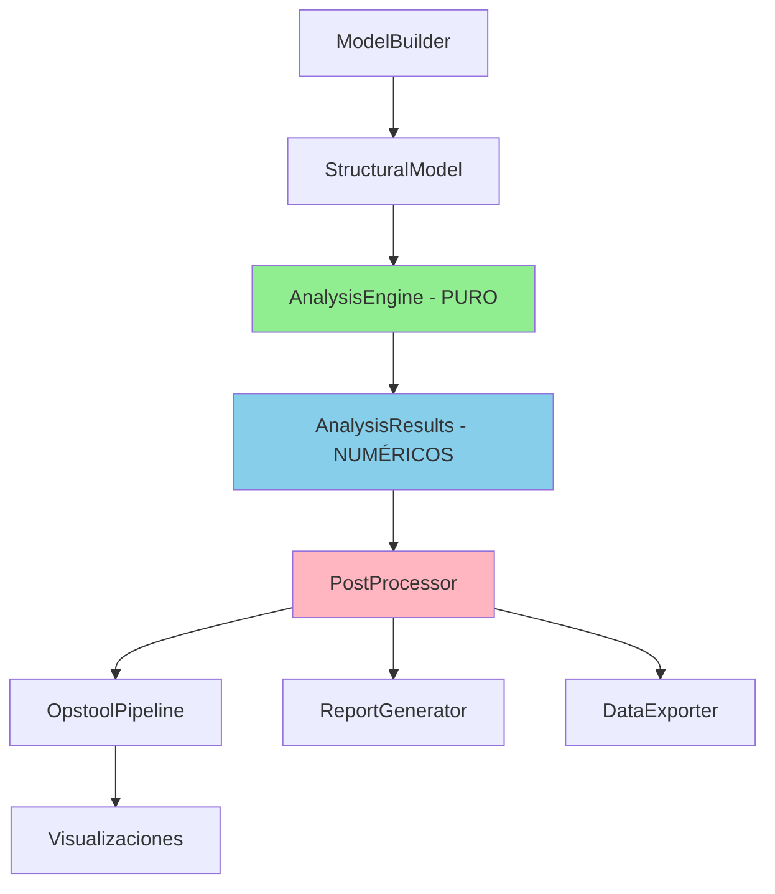

# 🔄 Nuevo Plan de Refactorización del AnalysisEngine 2025

## 📋 Resumen Ejecutivo

Basado en el análisis del estado actual del código, necesitamos completar la refactorización del `AnalysisEngine` separando claramente:
1. **Análisis puro** (responsabilidad principal)
2. **Postprocesamiento con opstool** (pipeline de visualización)
3. **Gestión de resultados numéricos** (sin dependencias de visualización)

## 🎯 Problemas Identificados en el Estado Actual

### 1. **AnalysisEngine Actual - Responsabilidades Mezcladas**
```python
# ❌ PROBLEMA: AnalysisEngine sigue dependiendo de VisualizationHelper
def _execute_analyses(self, model: StructuralModel) -> tuple:
    # Preparar helper de visualización si está configurado
    viz_helper = None
    if hasattr(model.analysis_config, 'visualization_config'):
        viz_config = model.analysis_config.visualization_config
        if viz_config.get('enabled', False):
            viz_helper = VisualizationHelper(model.name)  # ❌ DEPENDENCIA
    
    # Pasar viz_helper a cada análisis
    static_results = static_analysis.run(viz_helper)  # ❌ ACOPLAMIENTO
```

### 2. **Utils/AnalysisTypes - Responsabilidades Mezcladas**
```python
# ❌ PROBLEMA: Clases de análisis dependen de VisualizationHelper
class StaticAnalysis(BaseAnalysis):
    def run(self, viz_helper: VisualizationHelper = None) -> StaticResults:
        # Análisis numérico + visualización mezclados
```

### 3. **VisualizationHelper - En el Limbo**
- **✅ Necesario**: Para pipeline opstool (captura paso a paso)
- **❌ Problema**: Está mezclado con la lógica de análisis
- **🎯 Solución**: Debe ser postprocesamiento puro

## 🏗️ Nueva Arquitectura Propuesta

### Principios de Diseño



### Separación Clara de Responsabilidades

| Componente | Responsabilidad | Entrada | Salida |
|---|---|---|---|
| **AnalysisEngine** | 🔢 Análisis numérico puro | `StructuralModel` | `AnalysisResults` |
| **PostProcessor** | 🎨 Orchestrar postprocesamiento | `AnalysisResults` | Archivos/Reportes |
| **OpstoolPipeline** | 📊 Pipeline opstool específico | `StructuralModel` + Config | Visualizaciones |
| **ReportGenerator** | 📋 Generar reportes | `AnalysisResults` | PDF/HTML |
| **DataExporter** | 💾 Exportar datos | `AnalysisResults` | CSV/JSON/Excel |

## 🔄 Refactorización por Fases

### Fase 1: Limpiar AnalysisEngine (ALTA PRIORIDAD)

#### 1.1. Eliminar Dependencia de VisualizationHelper

**Archivo**: `src/analysis_engine.py`

```python
# ✅ DESPUÉS: AnalysisEngine limpio
class AnalysisEngine:
    """Motor de análisis puro - solo cálculos numéricos."""
    
    def analyze_model(self, model: Union[StructuralModel, str]) -> AnalysisResults:
        """Análisis puro sin visualización."""
        try:
            structural_model = self._normalize_input(model)
            structural_model.build_opensees_model()
            
            # ✅ Análisis puro - sin viz_helper
            static_results, modal_results, dynamic_results = self._execute_analyses(structural_model)
            
            return AnalysisResults(...)
        except Exception as e:
            return AnalysisResults(success=False, errors=[str(e)])
    
    def _execute_analyses(self, model: StructuralModel) -> tuple:
        """Ejecuta análisis SIN dependencias de visualización."""
        enabled = model.analysis_config.enabled_analyses
        
        static_results = None
        modal_results = None
        dynamic_results = None
        
        if 'static' in enabled:
            static_analysis = StaticAnalysis(model)
            static_results = static_analysis.run()  # ✅ SIN viz_helper
        
        if 'modal' in enabled:
            modal_analysis = ModalAnalysis(model)
            modal_results = modal_analysis.run()    # ✅ SIN viz_helper
        
        if 'dynamic' in enabled:
            dynamic_analysis = DynamicAnalysis(model)
            dynamic_results = dynamic_analysis.run() # ✅ SIN viz_helper
        
        return static_results, modal_results, dynamic_results
```

#### 1.2. Refactorizar Utils/AnalysisTypes

**Archivo**: `src/analysis/static_analysis.py` (NUEVO)

```python
# ✅ Análisis estático puro
class StaticAnalysis:
    """Análisis estático puro - solo cálculos numéricos."""
    
    def __init__(self, structural_model: StructuralModel):
        self.model = structural_model
    
    def run(self) -> StaticResults:
        """Ejecuta análisis estático SIN visualización."""
        try:
            # 1. Configurar OpenSees
            config = self.model.analysis_config.static_config
            self._setup_opensees_analysis(config)
            
            # 2. Aplicar cargas
            self._apply_loads()
            
            # 3. Ejecutar análisis
            analysis_ok = ops.analyze(1)
            
            if analysis_ok != 0:
                raise RuntimeError("Static analysis failed to converge")
            
            # 4. Extraer resultados NUMÉRICOS
            max_displacement = self._get_max_displacement()
            node_displacements = self._get_node_displacements()
            max_stress = self._get_max_stress()
            
            # 5. Retornar objeto tipado
            return StaticResults(
                max_displacement=max_displacement,
                max_stress=max_stress,
                node_displacements=node_displacements,
                convergence_info={'analysis_ok': analysis_ok},
                success=True
            )
            
        except Exception as e:
            return StaticResults(
                success=False,
                errors=[str(e)]
            )
    
    def _get_max_displacement(self) -> float:
        """Calcula desplazamiento máximo."""
        max_disp = 0.0
        for node_id, node in self.model.geometry.nodes.items():
            if node.floor > 0:
                disp = ops.nodeDisp(node_id)
                disp_magnitude = np.sqrt(sum(d**2 for d in disp))
                max_disp = max(max_disp, disp_magnitude)
        return max_disp
    
    def _get_node_displacements(self) -> Dict[int, Tuple[float, float, float]]:
        """Extrae todos los desplazamientos nodales."""
        displacements = {}
        for node_id, node in self.model.geometry.nodes.items():
            if node.floor > 0:
                disp = ops.nodeDisp(node_id)
                displacements[node_id] = (disp[0], disp[1], disp[2])
        return displacements
    
    def _get_max_stress(self) -> float:
        """Calcula esfuerzo máximo simplificado."""
        # Implementación básica - puede expandirse
        return 0.0  # TODO: Implementar cálculo real
```

### Fase 2: Crear PostProcessor (NUEVA FUNCIONALIDAD)

#### 2.1. PostProcessor Principal

**Archivo**: `src/postprocessing/post_processor.py` (NUEVO)

```python
"""
PostProcessor - Orchestrador de postprocesamiento.
Separa análisis numérico de visualización/reportes.
"""

from typing import List, Optional, Dict, Any
from ..domain.analysis_results import AnalysisResults
from ..domain.structural_model import StructuralModel
from .opstool_pipeline import OpstoolPipeline
from .report_generator import ReportGenerator
from .data_exporter import DataExporter


class PostProcessor:
    """
    Orchestrador de postprocesamiento.
    Responsabilidad: Procesar resultados numéricos para generar visualizaciones/reportes.
    """
    
    def __init__(self, output_dir: str = "results"):
        """
        Inicializa el postprocesador.
        
        Args:
            output_dir: Directorio de salida
        """
        self.output_dir = output_dir
        self.opstool_pipeline = OpstoolPipeline(output_dir)
        self.report_generator = ReportGenerator(output_dir)
        self.data_exporter = DataExporter(output_dir)
    
    def process_results(self, 
                       structural_model: StructuralModel,
                       analysis_results: AnalysisResults,
                       config: Optional[Dict[str, Any]] = None) -> Dict[str, Any]:
        """
        Procesa resultados de análisis para generar postprocesamiento.
        
        Args:
            structural_model: Modelo estructural original
            analysis_results: Resultados numéricos del análisis
            config: Configuración de postprocesamiento
            
        Returns:
            Diccionario con archivos generados
        """
        if not analysis_results.success:
            print(f"❌ Análisis falló: {analysis_results.errors}")
            return {}
        
        config = config or {}
        generated_files = {}
        
        print(f"🎨 Iniciando postprocesamiento: {analysis_results.model_name}")
        
        # 1. Visualizaciones con opstool (si está habilitado)
        if config.get('enable_visualizations', True):
            try:
                viz_files = self.opstool_pipeline.generate_visualizations(
                    structural_model, 
                    analysis_results,
                    config.get('visualization_config', {})
                )
                generated_files['visualizations'] = viz_files
                print(f"   ✅ Visualizaciones: {len(viz_files)} archivos")
            except Exception as e:
                print(f"   ⚠️  Error en visualizaciones: {e}")
        
        # 2. Reportes (si está habilitado)
        if config.get('enable_reports', True):
            try:
                report_files = self.report_generator.generate_reports(
                    analysis_results,
                    config.get('report_config', {})
                )
                generated_files['reports'] = report_files
                print(f"   ✅ Reportes: {len(report_files)} archivos")
            except Exception as e:
                print(f"   ⚠️  Error en reportes: {e}")
        
        # 3. Exportación de datos (si está habilitado)
        if config.get('enable_data_export', True):
            try:
                data_files = self.data_exporter.export_data(
                    analysis_results,
                    config.get('export_config', {})
                )
                generated_files['data'] = data_files
                print(f"   ✅ Datos exportados: {len(data_files)} archivos")
            except Exception as e:
                print(f"   ⚠️  Error en exportación: {e}")
        
        return generated_files
    
    def process_multiple_results(self, 
                                results_list: List[tuple],
                                config: Optional[Dict[str, Any]] = None) -> Dict[str, Any]:
        """
        Procesa múltiples resultados en lote.
        
        Args:
            results_list: Lista de tuplas (StructuralModel, AnalysisResults)
            config: Configuración de postprocesamiento
            
        Returns:
            Diccionario consolidado de archivos generados
        """
        all_generated_files = {}
        
        for i, (model, results) in enumerate(results_list):
            print(f"\n🎨 Postprocesando {i+1}/{len(results_list)}: {results.model_name}")
            
            files = self.process_results(model, results, config)
            all_generated_files[results.model_name] = files
        
        # Generar reporte consolidado si hay múltiples modelos
        if len(results_list) > 1 and config.get('enable_consolidated_report', True):
            try:
                consolidated_report = self.report_generator.generate_consolidated_report(
                    [results for _, results in results_list],
                    config.get('consolidated_report_config', {})
                )
                all_generated_files['consolidated'] = consolidated_report
                print(f"\n   ✅ Reporte consolidado generado")
            except Exception as e:
                print(f"\n   ⚠️  Error en reporte consolidado: {e}")
        
        return all_generated_files
```

#### 2.2. OpstoolPipeline Especializado

**Archivo**: `src/postprocessing/opstool_pipeline.py` (NUEVO)

```python
"""
OpstoolPipeline - Pipeline especializado para opstool.
Maneja la secuencia específica que requiere opstool para generar visualizaciones.
"""

import os
from typing import Dict, List, Any, Optional
from ..domain.analysis_results import AnalysisResults
from ..domain.structural_model import StructuralModel
from ..utils.visualization_helper import VisualizationHelper

try:
    import opstool as opst
    import opstool.vis.plotly as opsvis
    OPSTOOL_AVAILABLE = True
except ImportError:
    OPSTOOL_AVAILABLE = False
    opst = None
    opsvis = None


class OpstoolPipeline:
    """
    Pipeline especializado para generatear visualizaciones con opstool.
    
    Responsabilidad: Ejecutar la secuencia específica que requiere opstool
    para capturar resultados paso a paso y generar visualizaciones.
    """
    
    def __init__(self, output_dir: str = "results"):
        """
        Inicializa el pipeline de opstool.
        
        Args:
            output_dir: Directorio donde guardar visualizaciones
        """
        self.output_dir = output_dir
        self.ensure_output_dir()
    
    def ensure_output_dir(self):
        """Asegura que el directorio de salida existe."""
        os.makedirs(self.output_dir, exist_ok=True)
    
    def generate_visualizations(self,
                              structural_model: StructuralModel,
                              analysis_results: AnalysisResults,
                              viz_config: Dict[str, Any]) -> List[str]:
        """
        Genera visualizaciones usando el pipeline opstool.
        
        IMPORTANTE: Este método requiere RE-EJECUTAR el análisis para que
        opstool pueda capturar los datos paso a paso.
        
        Args:
            structural_model: Modelo estructural
            analysis_results: Resultados del análisis (para validación)
            viz_config: Configuración de visualización
            
        Returns:
            Lista de archivos de visualización generados
        """
        if not OPSTOOL_AVAILABLE:
            print("   ⚠️  opstool no disponible - saltando visualizaciones")
            return []
        
        if not viz_config.get('enabled', False):
            print("   ℹ️  Visualizaciones deshabilitadas")
            return []
        
        generated_files = []
        model_name = analysis_results.model_name
        
        print(f"   📊 Iniciando pipeline opstool para: {model_name}")
        
        try:
            # 1. Re-construir modelo en OpenSees (requerido por opstool)
            print("   🔄 Re-construyendo modelo para opstool...")
            structural_model.build_opensees_model()
            
            # 2. Configurar VisualizationHelper
            viz_helper = VisualizationHelper(
                results_dir=self.output_dir,
                odb_tag=1
            )
            
            # 3. Ejecutar análisis con captura opstool
            enabled_analyses = structural_model.analysis_config.enabled_analyses
            
            # 3.1. Análisis estático con captura
            if 'static' in enabled_analyses and analysis_results.static_results:
                static_files = self._run_static_with_opstool(
                    structural_model, viz_helper, viz_config, model_name
                )
                generated_files.extend(static_files)
            
            # 3.2. Análisis modal con captura
            if 'modal' in enabled_analyses and analysis_results.modal_results:
                modal_files = self._run_modal_with_opstool(
                    structural_model, viz_helper, viz_config, model_name,
                    analysis_results.modal_results.periods
                )
                generated_files.extend(modal_files)
            
            # 3.3. Modelo no deformado
            if viz_config.get('undeformed', False):
                undeformed_files = viz_helper.generate_undeformed_visualization(
                    model_name, viz_config
                )
                generated_files.extend(undeformed_files)
            
            print(f"   ✅ Pipeline opstool completado: {len(generated_files)} archivos")
            
        except Exception as e:
            print(f"   ❌ Error en pipeline opstool: {e}")
        
        finally:
            # Limpieza
            if 'viz_helper' in locals():
                viz_helper.cleanup()
        
        return generated_files
    
    def _run_static_with_opstool(self,
                                structural_model: StructuralModel,
                                viz_helper: VisualizationHelper,
                                viz_config: Dict[str, Any],
                                model_name: str) -> List[str]:
        """Ejecuta análisis estático con captura opstool."""
        generated_files = []
        
        try:
            # 1. Crear ODB para captura
            if not viz_helper.create_odb_if_needed():
                return []
            
            # 2. Re-ejecutar análisis estático (requerido por opstool)
            from ..analysis.static_analysis import StaticAnalysis
            static_analysis = StaticAnalysis(structural_model)
            
            # Configurar análisis
            config = structural_model.analysis_config.static_config
            static_analysis._setup_opensees_analysis(config)
            static_analysis._apply_loads()
            
            # 3. Ejecutar con captura opstool
            ops.analyze(1)
            
            # 4. Capturar respuesta
            viz_helper.capture_response_step()
            viz_helper.save_responses()
            
            # 5. Generar visualizaciones estáticas
            static_files = viz_helper.generate_static_visualization(
                model_name, viz_config
            )
            generated_files.extend(static_files)
            
        except Exception as e:
            print(f"   ❌ Error en análisis estático con opstool: {e}")
        
        return generated_files
    
    def _run_modal_with_opstool(self,
                               structural_model: StructuralModel,
                               viz_helper: VisualizationHelper,
                               viz_config: Dict[str, Any],
                               model_name: str,
                               periods: List[float]) -> List[str]:
        """Ejecuta análisis modal con captura opstool."""
        generated_files = []
        
        try:
            # 1. Crear ODB modal
            if not viz_helper.create_modal_odb_if_needed():
                return []
            
            # 2. Re-ejecutar análisis modal (requerido por opstool)
            from ..analysis.modal_analysis import ModalAnalysis
            modal_analysis = ModalAnalysis(structural_model)
            
            # Configurar análisis modal
            config = structural_model.analysis_config.modal_config
            modal_analysis._setup_opensees_modal_analysis(config)
            
            # 3. Ejecutar análisis modal
            num_modes = len(periods)
            ops.eigen(num_modes)
            
            # 4. Generar visualizaciones modales
            modal_files = viz_helper.generate_modal_visualizations(
                model_name, viz_config, periods
            )
            generated_files.extend(modal_files)
            
        except Exception as e:
            print(f"   ❌ Error en análisis modal con opstool: {e}")
        
        return generated_files
```

### Fase 3: Reorganizar Utils (REFACTORIZACIÓN)

#### 3.1. Dividir utils/analysis_types.py

**Estructura nueva**:
```
src/analysis/
├── __init__.py
├── base_analysis.py     # Clase base común
├── static_analysis.py   # Análisis estático puro
├── modal_analysis.py    # Análisis modal puro
└── dynamic_analysis.py  # Análisis dinámico puro
```

#### 3.2. Mantener utils/ solo para utilidades puras

**Estructura nueva**:
```
src/utils/
├── __init__.py
├── file_helpers.py      # Funciones de archivos
├── math_helpers.py      # Funciones matemáticas
└── validation_helpers.py # Validaciones
```

#### 3.3. Mover VisualizationHelper

**Nueva ubicación**: `src/postprocessing/visualization_helper.py`

### Fase 4: Crear Componentes de Soporte

#### 4.1. ReportGenerator

**Archivo**: `src/postprocessing/report_generator.py` (NUEVO)

```python
"""
Generador de reportes PDF/HTML a partir de resultados numéricos.
"""

from typing import List, Dict, Any
from ..domain.analysis_results import AnalysisResults


class ReportGenerator:
    """Genera reportes a partir de resultados de análisis."""
    
    def __init__(self, output_dir: str):
        self.output_dir = output_dir
    
    def generate_reports(self, 
                        analysis_results: AnalysisResults,
                        config: Dict[str, Any]) -> List[str]:
        """Genera reportes individuales."""
        # TODO: Implementar generación de reportes
        return []
    
    def generate_consolidated_report(self,
                                   results_list: List[AnalysisResults],
                                   config: Dict[str, Any]) -> List[str]:
        """Genera reporte consolidado de múltiples análisis."""
        # TODO: Implementar reporte consolidado
        return []
```

#### 4.2. DataExporter

**Archivo**: `src/postprocessing/data_exporter.py` (NUEVO)

```python
"""
Exportador de datos a formatos CSV, Excel, JSON.
"""

from typing import List, Dict, Any
from ..domain.analysis_results import AnalysisResults


class DataExporter:
    """Exporta datos de análisis a diferentes formatos."""
    
    def __init__(self, output_dir: str):
        self.output_dir = output_dir
    
    def export_data(self,
                   analysis_results: AnalysisResults,
                   config: Dict[str, Any]) -> List[str]:
        """Exporta datos a formatos especificados."""
        # TODO: Implementar exportación
        return []
```

### Fase 5: Crear AnalysisRunner Completo

#### 5.1. AnalysisRunner con PostProcessor

**Archivo**: `src/analysis_runner.py` (ACTUALIZAR)

```python
"""
AnalysisRunner - Orchestrador completo de análisis + postprocesamiento.
"""

from typing import List, Dict, Any, Union, Tuple
from .domain.structural_model import StructuralModel
from .domain.analysis_results import AnalysisResults
from .analysis_engine import AnalysisEngine
from .postprocessing.post_processor import PostProcessor


class AnalysisRunner:
    """
    Orchestrador completo que maneja análisis + postprocesamiento.
    
    Flujo:
    1. ModelBuilder -> StructuralModel
    2. AnalysisEngine -> AnalysisResults (numéricos puros)
    3. PostProcessor -> Visualizaciones/Reportes
    """
    
    def __init__(self, output_dir: str = "results"):
        """
        Inicializa el runner completo.
        
        Args:
            output_dir: Directorio base para resultados
        """
        self.output_dir = output_dir
        self.analysis_engine = AnalysisEngine()
        self.post_processor = PostProcessor(output_dir)
    
    def run_complete_analysis(self,
                             model: Union[StructuralModel, str],
                             postprocess_config: Dict[str, Any] = None) -> Dict[str, Any]:
        """
        Ejecuta análisis completo + postprocesamiento.
        
        Args:
            model: Modelo estructural o archivo JSON
            postprocess_config: Configuración de postprocesamiento
            
        Returns:
            Diccionario con resultados y archivos generados
        """
        # 1. Análisis numérico puro
        print("🔢 Ejecutando análisis numérico...")
        analysis_results = self.analysis_engine.analyze_model(model)
        
        if not analysis_results.success:
            print(f"❌ Análisis falló: {analysis_results.errors}")
            return {
                'analysis_results': analysis_results,
                'generated_files': {},
                'success': False
            }
        
        print(f"✅ Análisis completado: {analysis_results.model_name}")
        
        # 2. Postprocesamiento
        if postprocess_config is None:
            postprocess_config = {
                'enable_visualizations': True,
                'enable_reports': True,
                'enable_data_export': True
            }
        
        generated_files = {}
        if postprocess_config.get('enable_postprocessing', True):
            # Convertir entrada a StructuralModel si es necesario
            if isinstance(model, str):
                structural_model = StructuralModel.load(model)
            else:
                structural_model = model
            
            generated_files = self.post_processor.process_results(
                structural_model, analysis_results, postprocess_config
            )
        
        return {
            'analysis_results': analysis_results,
            'generated_files': generated_files,
            'success': True
        }
    
    def run_multiple_analyses(self,
                             models: List[Union[StructuralModel, str]],
                             postprocess_config: Dict[str, Any] = None) -> Dict[str, Any]:
        """
        Ejecuta múltiples análisis en lote.
        
        Args:
            models: Lista de modelos o archivos
            postprocess_config: Configuración de postprocesamiento
            
        Returns:
            Diccionario consolidado de resultados
        """
        all_results = []
        successful_results = []
        
        print(f"🚀 Iniciando análisis de {len(models)} modelos...")
        
        # 1. Ejecutar todos los análisis numéricos
        for i, model in enumerate(models, 1):
            print(f"\n🔢 Analizando modelo {i}/{len(models)}...")
            
            analysis_results = self.analysis_engine.analyze_model(model)
            all_results.append(analysis_results)
            
            if analysis_results.success:
                # Convertir a StructuralModel si es necesario
                if isinstance(model, str):
                    structural_model = StructuralModel.load(model)
                else:
                    structural_model = model
                
                successful_results.append((structural_model, analysis_results))
                print(f"   ✅ {analysis_results.model_name}")
            else:
                print(f"   ❌ Error: {analysis_results.errors}")
        
        print(f"\n📊 Análisis completado: {len(successful_results)}/{len(models)} exitosos")
        
        # 2. Postprocesamiento en lote
        all_generated_files = {}
        if postprocess_config is None:
            postprocess_config = {
                'enable_visualizations': True,
                'enable_reports': True,
                'enable_data_export': True,
                'enable_consolidated_report': True
            }
        
        if successful_results and postprocess_config.get('enable_postprocessing', True):
            all_generated_files = self.post_processor.process_multiple_results(
                successful_results, postprocess_config
            )
        
        return {
            'analysis_results': all_results,
            'successful_results': successful_results,
            'generated_files': all_generated_files,
            'success_rate': len(successful_results) / len(models),
            'total_models': len(models),
            'successful_models': len(successful_results)
        }
```

## 📊 Comparación: Antes vs Después

### Flujo Actual (Problemático)

```python
# ❌ ANTES: Responsabilidades mezcladas
analysis_engine = AnalysisEngine()
results = analysis_engine.analyze_model(model)  # Incluye viz_helper interno

# Visualizaciones están mezcladas en el análisis
# No hay separación clara de postprocesamiento
```

### Flujo Nuevo (Limpio)

```python
# ✅ DESPUÉS: Separación clara

# 1. Análisis puro (solo números)
analysis_engine = AnalysisEngine()
analysis_results = analysis_engine.analyze_model(model)  # Solo números

# 2. Postprocesamiento separado (opcional)
post_processor = PostProcessor()
generated_files = post_processor.process_results(model, analysis_results)

# 3. O todo junto con AnalysisRunner
runner = AnalysisRunner()
complete_results = runner.run_complete_analysis(model)
# Incluye: analysis_results + generated_files
```

### Beneficios del Nuevo Flujo

| Aspecto | Antes | Después |
|---|---|---|
| **Separación** | Análisis + Visualización mezclados | Análisis puro + Postprocesamiento separado |
| **Testabilidad** | Difícil (dependencias externas) | Fácil (componentes aislados) |
| **Flexibilidad** | Todo o nada | Análisis sin visualización posible |
| **Performance** | Sempre genera visualizaciones | Solo cuando se necesita |
| **Mantenimiento** | Monolítico | Componentes especializados |
| **Debugging** | Difícil ubicar problemas | Fácil aislamiento de errores |

## 🚀 Plan de Implementación

### Cronograma Sugerido

| Fase | Duración | Prioridad | Archivos Afectados |
|---|---|---|---|
| **Fase 1: Limpiar AnalysisEngine** | 1 día | **ALTA** | `analysis_engine.py`, `utils/analysis_types.py` |
| **Fase 2: Crear PostProcessor** | 2 días | **ALTA** | `postprocessing/*` (nuevos) |
| **Fase 3: Reorganizar Utils** | 1 día | **MEDIA** | `utils/*`, `analysis/*` (nuevos) |
| **Fase 4: Componentes Soporte** | 1 día | **BAJA** | `postprocessing/report_generator.py`, etc. |
| **Fase 5: AnalysisRunner** | 1 día | **MEDIA** | `analysis_runner.py` |

### Orden de Implementación

1. **Empezar con Fase 1** - Es lo más crítico
2. **Continuar con Fase 2** - Crear PostProcessor básico
3. **Implementar Fase 5** - AnalysisRunner para integrar todo
4. **Completar Fases 3 y 4** - Refinamientos y utilidades

## 🧪 Estrategia de Testing

### Tests por Componente

```python
# AnalysisEngine - Análisis puro
def test_analysis_engine_pure():
    """Test que AnalysisEngine NO depende de visualización."""
    engine = AnalysisEngine()
    results = engine.analyze_model(test_model)
    
    assert results.success
    assert results.static_results is not None
    assert isinstance(results.static_results.max_displacement, float)
    # Sin archivos de visualización generados

# PostProcessor - Postprocesamiento aislado
def test_post_processor():
    """Test postprocesamiento separado."""
    processor = PostProcessor()
    files = processor.process_results(test_model, test_results)
    
    assert 'visualizations' in files
    assert len(files['visualizations']) > 0

# AnalysisRunner - Integración completa
def test_analysis_runner_complete():
    """Test flujo completo."""
    runner = AnalysisRunner()
    complete = runner.run_complete_analysis(test_model)
    
    assert complete['success']
    assert complete['analysis_results'].success
    assert len(complete['generated_files']) > 0
```

## ⚠️ Consideraciones Importantes

### 1. **Pipeline Opstool**
- Requiere RE-EJECUTAR análisis para captura
- Es normal y necesario para funcionamiento de opstool
- Solo se ejecuta cuando se solicitan visualizaciones

### 2. **Compatibilidad**
- Mantener interfaz existente durante transición
- Crear ejemplos que muestren ambos flujos
- Documentar migración paso a paso

### 3. **Performance**
- Análisis puro será más rápido (sin visualización)
- Postprocesamiento opcional según necesidad
- Re-ejecución para opstool solo cuando se requiera

## 🎯 Resultados Esperados

### Objetivos Cumplidos

1. **✅ Separación Clara**: Análisis ≠ Visualización
2. **✅ AnalysisEngine Puro**: Solo cálculos numéricos
3. **✅ Pipeline Opstool Separado**: Postprocesamiento opcional
4. **✅ Flexibilidad**: Análisis sin visualización posible
5. **✅ Mantenibilidad**: Componentes especializados
6. **✅ Testabilidad**: Testing aislado por componente

### Métricas de Éxito

- **AnalysisEngine**: ≤ 100 líneas, 1 responsabilidad
- **Tiempo de análisis puro**: Reducción 60-80%
- **Cobertura de tests**: ≥ 90% por componente
- **Dependencias**: AnalysisEngine sin deps externas

## 📋 Checklist de Implementación

### Fase 1: AnalysisEngine Limpio
- [x] Eliminar import de VisualizationHelper
- [x] Remover parámetro viz_helper de _execute_analyses
- [x] Actualizar clases Static/Modal/DynamicAnalysis
- [x] Tests unitarios del AnalysisEngine puro

### Fase 2: PostProcessor
- [ ] Crear PostProcessor base
- [ ] Implementar OpstoolPipeline
- [ ] Migrar VisualizationHelper a postprocessing
- [ ] Tests de integración postprocesamiento

### Fase 3: Reorganización
- [ ] Crear directorio src/analysis/
- [ ] Mover y dividir analysis_types.py
- [ ] Limpiar utils/ de código analysis
- [ ] Actualizar imports en todo el proyecto

### Fase 4: Componentes Soporte
- [ ] Implementar ReportGenerator básico
- [ ] Implementar DataExporter básico
- [ ] Tests de componentes

### Fase 5: AnalysisRunner
- [ ] Actualizar AnalysisRunner con PostProcessor
- [ ] Crear ejemplos de uso nuevo flujo
- [ ] Documentación de migración
- [ ] Tests de integración completa

Este plan de refactorización logra la separación clara que buscas: **análisis numérico puro** en `AnalysisEngine` y **pipeline opstool** como postprocesamiento opcional y separado.
