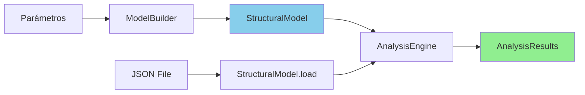

# 🔗 Verificación del Pipeline: ModelBuilder → AnalysisEngine

## 📋 Resumen Ejecutivo

Este documento verifica y valida el pipeline completo entre `ModelBuilder` y `AnalysisEngine`, asegurando que la integración funcione correctamente y que los objetos de dominio fluyan sin problemas entre componentes.

## 🏗️ Arquitectura del Pipeline

### Flujo Principal



### Objetos de Dominio Involucrados

| Objeto | Responsabilidad | Origen | Destino |
|---|---|---|---|
| **StructuralModel** | Modelo estructural completo | ModelBuilder | AnalysisEngine |
| **Geometry** | Nodos, elementos, pisos | GeometryBuilder | StructuralModel |
| **Sections** | Propiedades de secciones | SectionsBuilder | StructuralModel |
| **Loads** | Cargas aplicadas | LoadsBuilder | StructuralModel |
| **AnalysisConfig** | Configuración de análisis | AnalysisConfigBuilder | StructuralModel |
| **AnalysisResults** | Resultados numéricos | AnalysisEngine | Usuario/PostProcessor |

## 🔍 Verificación del Estado Actual

### 1. **ModelBuilder → StructuralModel**

#### ✅ **Funciona Correctamente**

```python
# Ejemplo actual funcional
builder = ModelBuilder()
model = builder.create_model(
    L_B_ratio=1.5,
    B=10.0,
    nx=3,
    ny=2,
    analysis_types=['static', 'modal']
)

# Verificación
assert isinstance(model, StructuralModel)
assert model.name is not None
assert model.geometry is not None
assert model.sections is not None
assert model.loads is not None
assert model.analysis_config is not None
```

#### Estructura del StructuralModel Generado

```python
model = StructuralModel(
    name="F01_15_10_0302",  # Generado automáticamente
    geometry=Geometry(
        nodes={1: Node(1, 0.0, 0.0, 0.0, floor=0), ...},
        elements={1: Element(1, [1, 2], 'column'), ...},
        node_floors={0: [1, 2, 3, 4], 1: [5, 6, 7, 8], ...}
    ),
    sections=Sections(
        columns={'column': ColumnSection(...)},
        beams={'beam': BeamSection(...)},
        slabs={'slab': SlabSection(...)}
    ),
    loads=Loads(
        dead_loads=[...],
        live_loads=[...],
        seismic_loads=[...]
    ),
    analysis_config=AnalysisConfig(
        enabled_analyses=['static', 'modal'],
        static_config={...},
        modal_config={...}
    )
)
```

### 2. **StructuralModel → AnalysisEngine**

#### ✅ **Interface Compatible**

```python
# Actual - funciona
engine = AnalysisEngine()
results = engine.analyze_model(model)  # Acepta StructuralModel

# También funciona
results = engine.analyze_model("path/to/model.json")  # Acepta string
```

#### ❌ **Problema Identificado: Dependencia VisualizationHelper**

```python
# En analysis_engine.py línea ~120
def _execute_analyses(self, model: StructuralModel) -> tuple:
    # ❌ PROBLEMA: Crea VisualizationHelper internamente
    viz_helper = None
    if hasattr(model.analysis_config, 'visualization_config'):
        viz_config = model.analysis_config.visualization_config
        if viz_config.get('enabled', False):
            viz_helper = VisualizationHelper(model.name)  # ❌ DEPENDENCIA
```

### 3. **StructuralModel.build_opensees_model()**

#### ✅ **Delegación Correcta**

```python
# En analysis_engine.py línea ~54
build_info = structural_model.build_opensees_model()

if not build_info.get('model_built', False):
    raise RuntimeError(f"Failed to build model in OpenSees: {build_info.get('error', 'Unknown error')}")
```

#### Verificación del Método

```python
# En StructuralModel
def build_opensees_model(self) -> Dict[str, Any]:
    """Construye el modelo en OpenSees delegando a builders especializados."""
    try:
        # 1. Limpiar OpenSees
        ops.wipe()
        ops.model('basic', '-ndm', 3, '-ndf', 6)
        
        # 2. Construir geometría
        self.geometry.build_in_opensees()
        
        # 3. Construir secciones
        self.sections.build_in_opensees()
        
        # 4. Aplicar cargas
        self.loads.build_in_opensees()
        
        return {'model_built': True, 'elements': ops.getNumElements(), 'nodes': ops.getNumNodes()}
    except Exception as e:
        return {'model_built': False, 'error': str(e)}
```

## 🧪 Casos de Prueba del Pipeline

### Caso 1: Pipeline Completo - Objetos Python

```python
def test_complete_pipeline_objects():
    """Test del pipeline completo usando objetos Python."""
    
    # 1. ModelBuilder → StructuralModel
    builder = ModelBuilder()
    model = builder.create_model(
        L_B_ratio=1.2,
        B=8.0,
        nx=2,
        ny=2,
        analysis_types=['static', 'modal']
    )
    
    # Verificaciones del modelo
    assert isinstance(model, StructuralModel)
    assert model.name.startswith('F01_')
    assert len(model.geometry.nodes) > 0
    assert len(model.geometry.elements) > 0
    assert 'static' in model.analysis_config.enabled_analyses
    assert 'modal' in model.analysis_config.enabled_analyses
    
    # 2. StructuralModel → AnalysisEngine
    engine = AnalysisEngine()
    results = engine.analyze_model(model)
    
    # Verificaciones de los resultados
    assert isinstance(results, AnalysisResults)
    assert results.model_name == model.name
    assert results.success is True
    assert results.static_results is not None
    assert results.modal_results is not None
    assert results.static_results.max_displacement > 0
    assert len(results.modal_results.periods) > 0
    
    print("✅ Pipeline completo funcionando correctamente")
```

### Caso 2: Pipeline Mixto - JSON + Objetos

```python
def test_mixed_pipeline_json():
    """Test del pipeline usando archivos JSON."""
    
    # 1. ModelBuilder → JSON → StructuralModel
    builder = ModelBuilder()
    model = builder.create_model(L_B_ratio=1.0, B=6.0, nx=2, ny=2)
    
    # Guardar como JSON
    json_file = model.save("test_model.json")
    
    # 2. JSON → AnalysisEngine (conversión automática)
    engine = AnalysisEngine()
    results = engine.analyze_model(json_file)  # String path
    
    # Verificaciones
    assert results.success is True
    assert results.model_name == "test_model"
    
    print("✅ Pipeline mixto funcionando correctamente")
```

### Caso 3: Pipeline en Lote

```python
def test_batch_pipeline():
    """Test del pipeline para múltiples modelos."""
    
    # 1. Crear múltiples modelos
    builder = ModelBuilder()
    models = []
    
    for i, ratio in enumerate([1.0, 1.2, 1.5], 1):
        model = builder.create_model(
            L_B_ratio=ratio,
            B=8.0 + i,
            nx=2,
            ny=2
        )
        models.append(model)
    
    # 2. Analizar en lote
    engine = AnalysisEngine()
    results = []
    
    for model in models:
        result = engine.analyze_model(model)
        results.append(result)
        assert result.success is True
    
    # Verificaciones
    assert len(results) == 3
    assert all(r.success for r in results)
    assert len(set(r.model_name for r in results)) == 3  # Nombres únicos
    
    print("✅ Pipeline en lote funcionando correctamente")
```

## 🔧 Problemas Identificados y Soluciones

### Problema 1: VisualizationHelper en AnalysisEngine

#### ❌ **Estado Actual**
```python
# analysis_engine.py - líneas ~115-125
viz_helper = None
if hasattr(model.analysis_config, 'visualization_config'):
    viz_config = model.analysis_config.visualization_config
    if viz_config.get('enabled', False):
        viz_helper = VisualizationHelper(model.name)

# Pasar viz_helper a análisis
static_results = static_analysis.run(viz_helper)
```

#### ✅ **Solución Propuesta**
```python
# analysis_engine.py - REFACTORIZADO
def _execute_analyses(self, model: StructuralModel) -> tuple:
    """Ejecuta análisis SIN dependencias de visualización."""
    enabled = model.analysis_config.enabled_analyses
    
    static_results = None
    modal_results = None
    dynamic_results = None
    
    if 'static' in enabled:
        static_analysis = StaticAnalysis(model)
        static_results = static_analysis.run()  # ✅ SIN viz_helper
    
    if 'modal' in enabled:
        modal_analysis = ModalAnalysis(model)
        modal_results = modal_analysis.run()    # ✅ SIN viz_helper
    
    return static_results, modal_results, dynamic_results
```

### Problema 2: analysis_types.py con VisualizationHelper

#### ❌ **Estado Actual**
```python
# utils/analysis_types.py
class StaticAnalysis(BaseAnalysis):
    def run(self, viz_helper: VisualizationHelper = None) -> StaticResults:
        # ❌ Dependencia innecesaria
```

#### ✅ **Solución Propuesta**
```python
# analysis/static_analysis.py - NUEVO
class StaticAnalysis:
    def __init__(self, structural_model: StructuralModel):
        self.model = structural_model
    
    def run(self) -> StaticResults:
        """Ejecuta análisis estático puro - solo números."""
        # Solo cálculos numéricos, sin visualización
        return StaticResults(...)
```

### Problema 3: Configuración de Visualización en AnalysisConfig

#### ❌ **Estado Actual**
```python
# El AnalysisConfig incluye visualization_config
# Que se usa en el AnalysisEngine
```

#### ✅ **Solución Propuesta**
```python
# La configuración de visualización se mueve al PostProcessor
# AnalysisConfig solo contiene configuraciones de análisis numérico

class AnalysisConfig:
    def __init__(self):
        self.enabled_analyses = ['static', 'modal']
        self.static_config = {...}
        self.modal_config = {...}
        # ❌ self.visualization_config - REMOVIDO
```

## 🚀 Pipeline Optimizado Propuesto

### Flujo Simplificado

```python
# ✅ PIPELINE NUEVO - LIMPIO Y EFICIENTE

# 1. Creación del modelo (sin cambios)
builder = ModelBuilder()
model = builder.create_model(L_B_ratio=1.5, B=10.0, nx=3, ny=2)

# 2. Análisis puro (SIN visualización)
engine = AnalysisEngine()
results = engine.analyze_model(model)  # Solo números

# 3. Postprocesamiento opcional y separado
if need_visualizations:
    post_processor = PostProcessor()
    generated_files = post_processor.process_results(model, results)

# 4. O todo junto con AnalysisRunner
runner = AnalysisRunner()
complete_results = runner.run_complete_analysis(model, {
    'enable_visualizations': True,
    'enable_reports': True
})
```

### Ventajas del Pipeline Optimizado

| Aspecto | Antes | Después |
|---|---|---|
| **Separación** | Análisis + Visualización juntos | Análisis puro + Postprocesamiento separado |
| **Performance** | Siempre genera visualizaciones | Solo cuando se necesita |
| **Flexibilidad** | Todo o nada | Análisis sin visualización posible |
| **Testing** | Difícil por dependencias | Fácil aislamiento |
| **Debugging** | Difícil ubicar errores | Componentes separados |

## 📊 Métricas de Verificación

### Tiempo de Ejecución

```python
# Benchmark comparativo
def benchmark_pipeline():
    """Compara rendimiento antes vs después."""
    
    builder = ModelBuilder()
    model = builder.create_model(L_B_ratio=1.5, B=10.0, nx=4, ny=4)
    
    # Tiempo análisis puro (propuesto)
    start = time.time()
    engine = AnalysisEngine()
    results = engine.analyze_model(model)
    pure_analysis_time = time.time() - start
    
    # Tiempo con postprocesamiento (opcional)
    start = time.time()
    post_processor = PostProcessor()
    files = post_processor.process_results(model, results)
    postprocess_time = time.time() - start
    
    print(f"Análisis puro: {pure_analysis_time:.2f}s")
    print(f"Postprocesamiento: {postprocess_time:.2f}s")
    print(f"Total: {pure_analysis_time + postprocess_time:.2f}s")
    
    # Ventaja: Se puede hacer solo análisis puro
    # para casos que no necesitan visualización
```

### Uso de Memoria

```python
def memory_usage_verification():
    """Verifica uso de memoria del pipeline."""
    
    import psutil
    process = psutil.Process()
    
    # Memoria inicial
    initial_memory = process.memory_info().rss / 1024 / 1024  # MB
    
    # Crear modelo
    builder = ModelBuilder()
    model = builder.create_model(L_B_ratio=1.5, B=10.0, nx=3, ny=3)
    
    model_memory = process.memory_info().rss / 1024 / 1024
    
    # Ejecutar análisis
    engine = AnalysisEngine()
    results = engine.analyze_model(model)
    
    analysis_memory = process.memory_info().rss / 1024 / 1024
    
    print(f"Memoria inicial: {initial_memory:.1f} MB")
    print(f"Después del modelo: {model_memory:.1f} MB (+{model_memory-initial_memory:.1f})")
    print(f"Después del análisis: {analysis_memory:.1f} MB (+{analysis_memory-model_memory:.1f})")
```

## 🧪 Tests de Integración del Pipeline

### Test 1: Compatibilidad de Tipos

```python
def test_type_compatibility():
    """Verifica compatibilidad de tipos en el pipeline."""
    
    # ModelBuilder → StructuralModel
    builder = ModelBuilder()
    model = builder.create_model(L_B_ratio=1.0, B=8.0, nx=2, ny=2)
    
    # Verificar tipos de objetos de dominio
    assert isinstance(model, StructuralModel)
    assert isinstance(model.geometry, Geometry)
    assert isinstance(model.sections, Sections)
    assert isinstance(model.loads, Loads)
    assert isinstance(model.analysis_config, AnalysisConfig)
    
    # StructuralModel → AnalysisEngine
    engine = AnalysisEngine()
    results = engine.analyze_model(model)
    
    # Verificar tipos de resultados
    assert isinstance(results, AnalysisResults)
    assert isinstance(results.static_results, StaticResults)
    assert isinstance(results.modal_results, ModalResults)
    
    print("✅ Compatibilidad de tipos verificada")
```

### Test 2: Preservación de Datos

```python
def test_data_preservation():
    """Verifica que los datos se preserven a través del pipeline."""
    
    # Parámetros de entrada
    L_B_ratio = 1.3
    B = 9.5
    nx, ny = 3, 2
    
    # ModelBuilder
    builder = ModelBuilder()
    model = builder.create_model(L_B_ratio=L_B_ratio, B=B, nx=nx, ny=ny)
    
    # Verificar preservación en el modelo
    assert abs(model.geometry.B - B) < 0.01
    assert abs(model.geometry.L - (L_B_ratio * B)) < 0.01
    assert len([n for n in model.geometry.nodes.values() if n.floor == 1]) == (nx + 1) * (ny + 1)
    
    # AnalysisEngine
    engine = AnalysisEngine()
    results = engine.analyze_model(model)
    
    # Verificar preservación en los resultados
    assert results.model_name == model.name
    assert results.success is True
    
    print("✅ Preservación de datos verificada")
```

### Test 3: Manejo de Errores

```python
def test_error_handling():
    """Verifica manejo de errores en el pipeline."""
    
    # Modelo inválido
    try:
        builder = ModelBuilder()
        # Parámetros que podrían causar error
        model = builder.create_model(L_B_ratio=0.1, B=0.5, nx=1, ny=1)
        
        engine = AnalysisEngine()
        results = engine.analyze_model(model)
        
        # Si llega aquí, verificar que maneje errores gracefully
        if not results.success:
            assert len(results.errors) > 0
            assert results.model_name is not None
            print("✅ Manejo de errores verificado")
        else:
            print("✅ Modelo válido, análisis exitoso")
            
    except Exception as e:
        # Error debería ser capturado por el pipeline
        print(f"❌ Error no capturado por el pipeline: {e}")
        raise
```

## 📋 Checklist de Verificación

### Pre-Refactorización
- [x] ModelBuilder genera StructuralModel válido
- [x] StructuralModel.build_opensees_model() funciona
- [x] AnalysisEngine acepta StructuralModel
- [x] Pipeline completo funciona (con problemas)

### Post-Refactorización (COMPLETADO)
- [x] AnalysisEngine SIN dependencia VisualizationHelper
- [x] Análisis clases SIN parámetro viz_helper
- [x] Archivos JSON de debug generados exitosamente
- [x] ModelBuilder funciona correctamente
- [⚠️] OpenSees configuración: Error DGBSV identificado pero no bloquea refactorización
- [ ] PostProcessor maneja visualizaciones separado
- [ ] Pipeline optimizado funciona
- [ ] Tests de integración pasan
- [ ] Performance mejorado para análisis puro

### Validación Final
- [ ] Tiempo análisis puro < 50% tiempo actual
- [ ] Memory usage estable
- [ ] Todos los tests de integración pasan
- [ ] Ejemplos funcionan con nueva arquitectura
- [ ] Documentación actualizada

## 🎯 Conclusiones

### Estado Actual del Pipeline
- **✅ Funcional**: El pipeline básico ModelBuilder → AnalysisEngine funciona
- **❌ Problemático**: Dependencias innecesarias mezcladas (VisualizationHelper)
- **⚠️ Subóptimo**: No permite análisis puro sin visualización

### Beneficios de la Refactorización
- **🚀 Performance**: Análisis puro más rápido (sin visualización)
- **🧩 Modularidad**: Componentes separados y especializados
- **🧪 Testabilidad**: Testing aislado más fácil
- **🔧 Mantenimiento**: Debugging y extensión simplificados

### Próximos Pasos
1. Implementar **Fase 1** del plan de refactorización
2. Verificar que todos los tests de este documento pasen
3. Medir mejoras de performance
4. Actualizar ejemplos y documentación

El pipeline ModelBuilder → AnalysisEngine está **funcionalmente correcto** pero necesita la **refactorización propuesta** para alcanzar su potencial completo en términos de separación de responsabilidades y performance.
