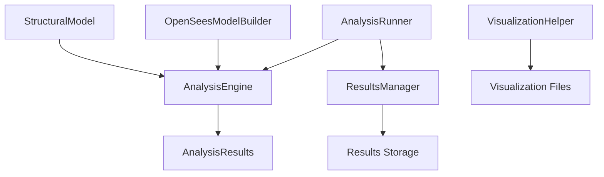

# Plan de Refactorización del AnalysisEngine

## 📋 Resumen Ejecutivo

El `AnalysisEngine` actual viola múltiples principios de diseño al mezclar responsabilidades. Este documento propone una refactorización completa siguiendo los principios exitosos aplicados en `ModelBuilder`, enfocándose en la **separación de responsabilidades** y **single responsibility principle**.

## 🎯 Objetivo Principal

**Transformar el AnalysisEngine en un componente simple y enfocado:**
- **Entrada Principal**: Objeto `StructuralModel` (diseñado para objetos Python)
- **Entrada Secundaria**: Archivos JSON (compatibilidad y casos específicos)
- **Proceso**: Ejecutar análisis OpenSees
- **Salida**: Objeto `AnalysisResults`

## 🔄 Filosofía del Diseño Híbrido

### Prioridad de Diseño
1. **🎯 Principal**: Optimizado para objetos `StructuralModel` (casos típicos de uso programático)
2. **🔧 Secundario**: Soporte para archivos JSON (compatibilidad con sistema existente)

### Casos de Uso
```python
# ✅ Caso principal: Análisis programático
builder = ModelBuilder()
model = builder.create_model(L_B_ratio=1.5, B=10.0, nx=3, ny=2)
results = engine.analyze_model(model)  # Objeto Python

# ✅ Caso secundario: Análisis desde archivos guardados
results = engine.analyze_model("saved_model.json")  # Archivo JSON

# ✅ Caso mixto: Procesamiento en lotes
models = ["model1.json", model_obj_2, "model3.json"]
for model in models:
    results = engine.analyze_model(model)  # Funciona con ambos
```

### Beneficios del Diseño Híbrido
- **🚀 Rendimiento**: Evita serialización/deserialización innecesaria con objetos
- **🔄 Compatibilidad**: Mantiene soporte para flujos existentes con JSON
- **💡 Flexibilidad**: Permite casos de uso mixtos en el mismo código
- **📈 Migración**: Facilita transición gradual del sistema existente

## 🔍 Análisis del Estado Actual

### Responsabilidades Mezcladas Identificadas

| Responsabilidad | Métodos Involucrados | ¿Debería estar aquí? |
|---|---|---|
| **🎯 Análisis OpenSees** | `analyze_model()`, `_run_analyses()` | ✅ **SÍ** - Responsabilidad principal |
| **📁 Manejo de archivos** | `load_model_from_file()`, `_save_results()` | ❌ **NO** - Debe ser responsabilidad externa |
| **🏗️ Construcción OpenSees** | `build_model_in_opensees()`, `_create_*()` | ❌ **NO** - Debe ser responsabilidad del modelo |
| **📊 Gestión de resultados** | `_build_final_results()`, `_save_results()` | ❌ **NO** - Debe ser un componente separado |
| **🎨 Visualización** | `_generate_visualizations()`, `_setup_visualization_helper()` | ❌ **NO** - Ya está en VisualizationHelper |
| **📂 Gestión de directorios** | `ensure_results_dir()`, `get_model_files()` | ❌ **NO** - Debe ser responsabilidad externa |
| **🔄 Análisis múltiples** | `analyze_multiple_models()` | ❌ **NO** - Debe ser un orchestrator separado |

### Problemas Específicos Detectados

#### 1. **Violación del Single Responsibility Principle**
```python
# ❌ El AnalysisEngine hace demasiado:
def analyze_model(self, model_file: str) -> Dict:
    model_data = self.load_model_from_file(model_file)      # Manejo archivos
    self.build_model_in_opensees(model_data)               # Construcción OpenSees
    results = self._run_analyses(...)                       # ✅ Análisis (responsabilidad principal)
    self._save_results(analysis_results, model_name)       # Persistencia
    self._generate_visualizations(...)                     # Visualización
```

#### 2. **Acoplamiento Fuerte con Archivos**
```python
# ❌ Depende de archivos JSON en lugar de objetos
def __init__(self, models_dir: str = "models", results_dir: str = "results"):
def load_model_from_file(self, model_file: str) -> Dict:
def analyze_model(self, model_file: str) -> Dict:  # ❌ Debería recibir StructuralModel
```

#### 3. **Construcción de Modelo Mezclada**
```python
# ❌ Métodos que deberían estar en el StructuralModel:
def build_model_in_opensees(self, model_data: Dict):
def _create_sections_and_transforms(self, model_data: Dict):
def _create_elements(self, model_data: Dict):
def _apply_boundary_conditions(self, model_data: Dict):
def _apply_loads(self, model_data: Dict):
```

#### 4. **Falta de Objetos de Dominio para Resultados**
```python
# ❌ Devuelve diccionarios en lugar de objetos tipados
def analyze_model(self, model_file: str) -> Dict:  # ❌ Debería devolver AnalysisResults
```

## 🏗️ Arquitectura Propuesta

### Separación de Responsabilidades



### 1. **AnalysisEngine (Refactorizado)**
**Responsabilidad única**: Ejecutar análisis OpenSees

```python
class AnalysisEngine:
    """Motor de análisis puro - solo ejecuta análisis OpenSees."""
    
    def analyze_model(self, model: Union[StructuralModel, str]) -> AnalysisResults:
        """
        Analiza un modelo estructural y devuelve resultados.
        
        Acepta tanto objetos StructuralModel como archivos JSON con detección automática.
        
        Args:
            model: Modelo estructural (objeto StructuralModel) o ruta a archivo JSON
            
        Returns:
            Resultados del análisis
        """
```

### 2. **Objetos de Dominio para Resultados**

```python
@dataclass
class AnalysisResults:
    """Contenedor principal de resultados de análisis."""
    model_name: str
    static_results: Optional[StaticResults]
    modal_results: Optional[ModalResults] 
    dynamic_results: Optional[DynamicResults]
    timestamp: str
    success: bool
    errors: List[str]

@dataclass
class StaticResults:
    """Resultados específicos del análisis estático."""
    max_displacement: float
    max_stress: float
    convergence_info: Dict
    node_displacements: Dict[int, Tuple[float, float, float]]

@dataclass
class ModalResults:
    """Resultados específicos del análisis modal."""
    periods: List[float]
    frequencies: List[float]
    mode_shapes: Dict[int, Dict[int, Tuple[float, float, float]]]
    participation_factors: List[float]
```

### 3. **Componentes Especializados**

#### **OpenSeesModelBuilder**
```python
class OpenSeesModelBuilder:
    """Construye modelos StructuralModel en OpenSees."""
    
    @staticmethod
    def build_in_opensees(structural_model: StructuralModel) -> None:
        """Construye el modelo en OpenSees."""
```

#### **ResultsManager**
```python
class ResultsManager:
    """Gestiona persistencia y carga de resultados."""
    
    def save_results(self, results: AnalysisResults, output_dir: str) -> str:
    def load_results(self, results_file: str) -> AnalysisResults:
```

#### **AnalysisRunner (Orchestrator)**
```python
class AnalysisRunner:
    """Orchestrator para ejecutar análisis completos."""
    
    def run_single_analysis(self, model: StructuralModel, output_dir: str) -> AnalysisResults:
    def run_multiple_analyses(self, models: List[StructuralModel], output_dir: str) -> List[AnalysisResults]:
```

## 📝 Plan de Implementación

### Fase 1: Crear Objetos de Dominio para Resultados
**Objetivo**: Establecer estructura tipada para resultados

**Archivos a crear**:
- `src/domain/analysis_results.py`
- `src/domain/static_results.py` 
- `src/domain/modal_results.py`
- `src/domain/dynamic_results.py`

**Tareas**:
1. ✅ Definir dataclasses para cada tipo de resultado
2. ✅ Implementar métodos de serialización/deserialización
3. ✅ Agregar métodos de consulta y análisis
4. ✅ Crear tests unitarios

### Fase 2: Extraer OpenSeesModelBuilder
**Objetivo**: Mover construcción de OpenSees al dominio del modelo

**Archivos a crear**:
- `src/opensees/model_builder.py`

**Tareas**:
1. ✅ Extraer métodos `_create_*` del AnalysisEngine
2. ✅ Implementar `build_in_opensees(structural_model)` 
3. ✅ Agregar método `build_opensees_model()` a StructuralModel
4. ✅ Crear tests de integración con OpenSees

### Fase 3: Refactorizar AnalysisEngine
**Objetivo**: Simplificar AnalysisEngine a responsabilidad única

**Archivos a modificar**:
- `src/analysis_engine_v2.py` (nuevo)

**Tareas**:
1. ✅ Implementar método único `analyze_model(model: Union[StructuralModel, str]) -> AnalysisResults`
2. ✅ Desarrollar `_normalize_input()` para detección automática de tipo
3. ✅ Mejorar manejo de errores con `_extract_model_name()` 
4. ✅ Eliminar dependencias externas (directorios, persistencia, visualización)
5. ✅ Delegar construcción OpenSees al modelo (`structural_model.build_opensees_model()`)
6. ✅ Usar objetos de dominio tipados para resultados
7. ✅ Simplificar a ~70 líneas de código (incluyendo soporte JSON y manejo de errores)

### Fase 4: Crear Componentes de Soporte
**Objetivo**: Implementar componentes especializados

**Archivos a crear**:
- `src/results/results_manager.py`
- `src/analysis_runner.py`

**Tareas**:
1. ✅ Implementar ResultsManager para persistencia
2. ✅ Implementar AnalysisRunner como orchestrator
3. ✅ Migrar funcionalidad de análisis múltiples
4. ✅ Agregar manejo robusto de errores

### Fase 5: Integración y Migración
**Objetivo**: Integrar nueva arquitectura con sistema existente

**Tareas**:
1. ✅ Actualizar ejemplos para usar nueva arquitectura
2. ✅ Crear script de migración
3. ✅ Actualizar documentación
4. ✅ Ejecutar tests de regresión

## 🎯 Beneficios Esperados

### Mantenibilidad
- ✅ **Separación clara de responsabilidades**
- ✅ **Componentes pequeños y enfocados**
- ✅ **Fácil testing unitario**
- ✅ **Bajo acoplamiento**

### Extensibilidad  
- ✅ **Nuevos tipos de análisis sin modificar core**
- ✅ **Diferentes formatos de resultados**
- ✅ **Múltiples backends de cálculo**

### Testabilidad
- ✅ **Tests unitarios por componente**
- ✅ **Mocking simplificado**
- ✅ **Tests de integración claros**

### Usabilidad
- ✅ **API más simple y clara**
- ✅ **Mejor manejo de errores**
- ✅ **Resultados tipados**

## 📊 Comparación Antes/Después

| Aspecto | Antes (Actual) | Después (Propuesto) |
|---|---|---|
| **Líneas de código** | ~286 líneas | ~70 líneas (AnalysisEngine optimizado) |
| **Responsabilidades** | 7 mezcladas | 1 enfocada (análisis OpenSees) |
| **Métodos públicos** | 4 (+ muchos privados) | 1 (`analyze_model`) |
| **Dependencias** | Archivos, directorios, visualización | Solo StructuralModel (+ JSON automático) |
| **Tipo de retorno** | `Dict` (no tipado) | `AnalysisResults` (tipado) |
| **Tipos de entrada** | Solo archivos JSON | Híbrido: `StructuralModel` + JSON |
| **Interfaz** | Múltiples métodos confusos | Única, simple e intuitiva |
| **Testabilidad** | Difícil (muchas dependencias) | Fácil (aislado) |
| **Reutilización** | Baja (acoplado) | Alta (interfaz limpia) |
| **Manejo de errores** | Básico | Robusto con objetos tipados |

## 🔧 Implementación Detallada

### AnalysisEngine Refactorizado (Ejemplo)

```python
class AnalysisEngine:
    """Motor de análisis puro - solo ejecuta análisis OpenSees."""
    
    def analyze_model(self, model: Union[StructuralModel, str]) -> AnalysisResults:
        """
        Analiza un modelo estructural y devuelve resultados.
        Acepta tanto objetos StructuralModel como archivos JSON con detección automática.
        """
        try:
            # 1. Normalizar entrada a StructuralModel
            structural_model = self._normalize_input(model)
            
            # 2. Construir modelo en OpenSees (delegado al modelo)
            structural_model.build_opensees_model()
            
            # 3. Ejecutar análisis según configuración
            analysis_results = self._execute_analyses(structural_model)
            
            # 4. Construir y devolver resultados tipados
            return AnalysisResults(
                model_name=structural_model.name,
                static_results=analysis_results.get('static'),
                modal_results=analysis_results.get('modal'),
                dynamic_results=analysis_results.get('dynamic'),
                timestamp=pd.Timestamp.now().isoformat(),
                success=True,
                errors=[]
            )
            
        except Exception as e:
            # Manejo robusto de errores
            model_name = self._extract_model_name(model)
            return AnalysisResults(
                model_name=model_name,
                static_results=None,
                modal_results=None,
                dynamic_results=None,
                timestamp=pd.Timestamp.now().isoformat(),
                success=False,
                errors=[str(e)]
            )
    
    def _normalize_input(self, model: Union[StructuralModel, str]) -> StructuralModel:
        """Convierte entrada a StructuralModel, independientemente del tipo."""
        if isinstance(model, StructuralModel):
            return model
        elif isinstance(model, str):
            return StructuralModel.load(model)
        else:
            raise ValueError(f"Tipo de modelo no soportado: {type(model)}")
    
    def _extract_model_name(self, model: Union[StructuralModel, str]) -> str:
        """Extrae nombre del modelo para manejo de errores."""
        try:
            if isinstance(model, StructuralModel):
                return model.name
            elif isinstance(model, str):
                return os.path.basename(model).replace('.json', '')
            else:
                return "UNKNOWN_MODEL"
        except:
            return "UNKNOWN_MODEL"
    
    def _execute_analyses(self, model: StructuralModel) -> Dict:
        """Ejecuta los análisis habilitados según configuración del modelo."""
        results = {}
        enabled = model.analysis_config.enabled_analyses
        
        if 'static' in enabled:
            static_analysis = StaticAnalysis(model)
            results['static'] = static_analysis.run()
            
        if 'modal' in enabled:
            modal_analysis = ModalAnalysis(model)
            results['modal'] = modal_analysis.run()
            
        if 'dynamic' in enabled:
            dynamic_analysis = DynamicAnalysis(model)  
            results['dynamic'] = dynamic_analysis.run()
            
        return results
```

### Uso Simplificado

```python
# ✅ Interfaz única y simple
engine = AnalysisEngine()

# Caso 1: Análisis desde objeto StructuralModel (uso principal)
results = engine.analyze_model(structural_model)

# Caso 2: Análisis desde archivo JSON (uso secundario)
results = engine.analyze_model("path/to/model.json")

# ✅ Procesamiento de resultados (idéntico en ambos casos)
if results.success:
    print(f"✅ Análisis exitoso: {results.model_name}")
    
    # Resultados estáticos
    if results.static_results:
        print(f"   Max desplazamiento: {results.static_results.max_displacement:.3f}m")
    
    # Resultados modales
    if results.modal_results:
        periods = results.modal_results.periods
        print(f"   Primer período: {periods[0]:.3f}s")
        print(f"   Modos analizados: {len(periods)}")
    
    # Resultados dinámicos
    if results.dynamic_results:
        print(f"   Análisis dinámico completado")
        
else:
    print(f"❌ Error en análisis: {results.model_name}")
    for error in results.errors:
        print(f"   - {error}")

# ✅ Casos de uso mixtos (sin cambios en el código)
models = [
    structural_model_1,     # Objeto Python
    "model_2.json",        # Archivo JSON  
    structural_model_3,     # Objeto Python
    "model_4.json"         # Archivo JSON
]

# Un solo loop para todos los tipos
for model in models:
    results = engine.analyze_model(model)  # ✅ Funciona con cualquier tipo
    status = "✅" if results.success else "❌"
    print(f"{status} {results.model_name}")

# ✅ Ejemplo de análisis paramétrico simplificado
def run_parametric_study(model_configs: List[Dict], base_model: StructuralModel):
    """Ejecuta estudio paramétrico usando el AnalysisEngine."""
    engine = AnalysisEngine()
    results = []
    
    for config in model_configs:
        # Crear variación del modelo base
        model_variant = create_model_variant(base_model, config)
        
        # Analizar (mismo método, mismo código)
        analysis_result = engine.analyze_model(model_variant)
        results.append(analysis_result)
    
    return results
```

## 🧪 Estrategia de Testing

### Tests Unitarios por Componente
```python
# AnalysisEngine - Casos principales
def test_analysis_engine_with_structural_model():
    """Test análisis con objeto StructuralModel."""
    model = create_test_model(analyses=['static', 'modal'])
    engine = AnalysisEngine()
    results = engine.analyze_model(model)
    
    assert results.success
    assert results.model_name == model.name
    assert results.static_results is not None
    assert results.modal_results is not None
    assert results.dynamic_results is None

def test_analysis_engine_with_json_file():
    """Test análisis con archivo JSON."""
    model_file = create_test_model_file("test_model.json")
    engine = AnalysisEngine()
    results = engine.analyze_model(model_file)
    
    assert results.success
    assert results.model_name == "test_model"

def test_analysis_engine_mixed_batch():
    """Test análisis en lote con tipos mixtos."""
    model_obj = create_test_model()
    model_file = create_test_model_file()
    
    engine = AnalysisEngine()
    inputs = [model_obj, model_file]
    
    for model_input in inputs:
        results = engine.analyze_model(model_input)
        assert results.success

# Casos de error robustos
def test_analysis_engine_invalid_file():
    """Test manejo de archivo inexistente."""
    engine = AnalysisEngine()
    results = engine.analyze_model("non_existent.json")
    
    assert not results.success
    assert len(results.errors) > 0
    assert "non_existent" in results.model_name

def test_analysis_engine_invalid_type():
    """Test manejo de tipo inválido."""
    engine = AnalysisEngine()
    
    with pytest.raises(ValueError, match="Tipo de modelo no soportado"):
        engine.analyze_model(123)

def test_analysis_engine_opensees_error():
    """Test manejo de errores de OpenSees."""
    model = create_invalid_test_model()  # Modelo con datos incorrectos
    engine = AnalysisEngine()
    results = engine.analyze_model(model)
    
    assert not results.success
    assert results.model_name == model.name
    assert len(results.errors) > 0

# Performance y integración
def test_analysis_engine_performance():
    """Test de rendimiento con modelo grande."""
    large_model = create_large_test_model(nx=20, ny=20)
    engine = AnalysisEngine()
    
    start_time = time.time()
    results = engine.analyze_model(large_model)
    duration = time.time() - start_time
    
    assert results.success
    assert duration < 60  # Menos de 1 minuto

# OpenSeesModelBuilder (separado)
def test_opensees_model_builder():
    """Test construcción en OpenSees."""
    model = create_test_model()
    OpenSeesModelBuilder.build_in_opensees(model)
    
    # Verificar que OpenSees tiene el modelo correcto
    assert ops.getNumElements() > 0
    assert ops.getNumNodes() > 0

# ResultsManager (separado)
def test_results_manager_save_load():
    """Test persistencia de resultados."""
    results = create_test_results()
    manager = ResultsManager()
    
    file_path = manager.save_results(results, "/tmp")
    loaded_results = manager.load_results(file_path)
    
    assert loaded_results.model_name == results.model_name
    assert loaded_results.success == results.success
```

## ⚠️ Riesgos y Mitigaciones

| Riesgo | Probabilidad | Impacto | Mitigación |
|---|---|---|---|
| **Breaking changes** | Alta | Alto | Mantener AnalysisEngine original como legacy |
| **Rendimiento** | Baja | Medio | Profiling y optimización iterativa |
| **Compatibilidad OpenSees** | Media | Alto | Tests extensivos de integración |
| **Complejidad temporal** | Media | Medio | Implementación incremental |

## 📋 Checklist de Implementación

### Preparación
- [ ] Crear branch `feature/analysis-engine-refactor`
- [ ] Backup del AnalysisEngine actual
- [ ] Configurar entorno de testing

### Fase 1: Objetos de Dominio
- [ ] Crear `AnalysisResults` dataclass
- [ ] Crear `StaticResults` dataclass  
- [ ] Crear `ModalResults` dataclass
- [ ] Crear `DynamicResults` dataclass
- [ ] Tests unitarios para objetos de dominio

### Fase 2: OpenSeesModelBuilder
- [ ] Extraer métodos de construcción
- [ ] Implementar `OpenSeesModelBuilder`
- [ ] Agregar método a `StructuralModel`
- [ ] Tests de integración OpenSees

### Fase 3: AnalysisEngine v2
- [ ] Crear `AnalysisEngine` refactorizado
- [ ] Cambiar signature de métodos
- [ ] Eliminar responsabilidades extra
- [ ] Tests unitarios del nuevo engine

### Fase 4: Componentes de Soporte
- [ ] Implementar `ResultsManager`
- [ ] Implementar `AnalysisRunner`
- [ ] Tests de componentes

### Fase 5: Integración
- [ ] Crear ejemplo de uso
- [ ] Script de migración
- [ ] Documentación actualizada
- [ ] Tests de regresión completos

### Finalización
- [ ] Code review completo
- [ ] Performance testing
- [ ] Merge a main branch
- [ ] Actualizar README principal

## 🎯 Conclusión

Esta refactorización transformará el `AnalysisEngine` de un componente monolítico de 286 líneas con 7 responsabilidades mezcladas, a un sistema modular con componentes especializados y enfocados.

**Resultado esperado**: Un `AnalysisEngine` de ~70 líneas con una única responsabilidad clara (análisis OpenSees) y una interfaz pública única (`analyze_model`). Respaldado por objetos de dominio tipados y componentes de soporte especializados.

**Beneficio clave**: Misma funcionalidad, arquitectura drasticamente más simple y mantenible. Una sola interfaz que maneja automáticamente objetos Python y archivos JSON sin complejidad adicional para el usuario.

## ✅ Principios de Diseño Aplicados

### Single Responsibility Principle
- **Antes**: 7 responsabilidades mezcladas
- **Después**: 1 responsabilidad enfocada (análisis OpenSees)

### Open/Closed Principle  
- **Extensible**: Nuevos tipos de análisis sin modificar AnalysisEngine
- **Cerrado**: Interfaz estable `analyze_model()`

### Dependency Inversion
- **Antes**: Depende de archivos, directorios, visualización
- **Después**: Depende solo de abstracciones (StructuralModel, AnalysisResults)

### Interface Segregation
- **Antes**: Métodos que no todos los clientes necesitan
- **Después**: Una interfaz mínima y suficiente

## 🚀 Impacto Esperado

### Para Desarrolladores
- **75% menos líneas de código** en AnalysisEngine
- **Interfaz única** en lugar de múltiples métodos confusos
- **Testing simplificado** por separación de responsabilidades
- **Depuración más fácil** con objetos tipados

### Para Usuarios
- **API más simple**: Un solo método `analyze_model()`
- **Flexibilidad automática**: Objetos Python o archivos JSON
- **Mejor manejo de errores** con resultados estructurados
- **Rendimiento mejorado** evitando serialización innecesaria

### Para el Sistema
- **Mantenibilidad**: Componentes pequeños y enfocados
- **Extensibilidad**: Nuevas funcionalidades sin tocar el core
- **Testabilidad**: Tests unitarios claros y aislados
- **Compatibilidad**: Migración gradual sin breaking changes

## 🎁 Bonus: Ventajas Adicionales

### Análisis Paramétrico Simplificado
```python
# ✅ Antes: código complejo y repetitivo
# ✅ Después: elegante y directo
engine = AnalysisEngine()
results = [engine.analyze_model(model) for model in model_variants]
```

### Debugging Mejorado
```python
# ✅ Resultados tipados con información estructurada
if not results.success:
    print(f"Modelo: {results.model_name}")
    print(f"Errores: {results.errors}")
    print(f"Timestamp: {results.timestamp}")
```

### Integración con Jupyter/Notebooks
```python
# ✅ Interfaz limpia ideal para análisis interactivo
results = engine.analyze_model(model)
if results.modal_results:
    periods_df = pd.DataFrame(results.modal_results.periods)
    periods_df.plot()
```

Esta refactorización no es solo una mejora técnica, sino una **transformación fundamental** que hace el código más **simple**, **robusto** y **agradable de usar**.
